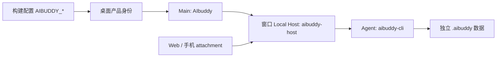

# AIbuddy 产品命名

## 规则与范围

- 产品显示名为 `AIbuddy`；开发版和预览版分别为 `AIbuddy Dev`、`AIbuddy Preview`。
- 命令、包命名空间、文件名、目录、进程前缀及应用自有协议使用 `aibuddy`；环境变量与编译注入常量使用 `AIBUDDY_`。
- 桌面应用标识为 `dev.aibuddy.app`，预览版为 `dev.aibuddy.app.preview`；Linux 可执行文件和包名分别为 `aibuddy`、`aibuddy-preview`。
- 工作区包统一使用 `@aibuddy/`，Agent 位于 `apps/aibuddy-cli`，服务端 CLI 位于 `packages/aibuddy-server-cli`，构建入口为 `pnpm build:aibuddy`。
- 新的个人数据根目录为 `~/.aibuddy`，项目配置为 `aibuddy.json` 或 `.aibuddy/config.json`；本仓插件清单位于 `.aibuddy-plugin/plugin.json`。
- 同步更新桌面与 Web 页面、CLI 帮助、翻译、配置模板、原生辅助进程、构建脚本、文档、技能和锁文件引用。
- 本地 Git 工作区目录及 Git remote 不变；仓库改名和线上发布不属于此次源码改名。

## 所有者与接口

沿用现有所有者和依赖方向：桌面构建身份由 `desktop-product-identity.mjs` 管理；运行时路径由现有 services/CLI 路径解析器管理；跨进程命名由 shared 的 process-names 管理；不引入新的状态或平行配置层。



进程启动顺序、owner/lease、workspaceIdentity、会话队列及事件时序保持现有语义。Desktop continuous 与手机 replayable 链路均须使用同一版本的 AIbuddy 组件；原 ZCode 远端二进制不能与改名后的内部协议混用。

## 上游兼容与迁移边界

- 保留真实上游域名、服务端 API 路径、已发布插件市场 ID、MCP 元数据与鉴权协议、Coding Plan 网页通信字段；这些由外部服务拥有。源码标识符可改名，外部线协议必须保持一致。
- 插件读取继续接受上游 `.zcode-plugin` 格式，新建插件使用 `.aibuddy-plugin`。旧的 `ZCODE_PLUGIN_*` 与 `ZCODE_PROJECT_DIR` 仅在插件边界兼容，并与新变量共用宿主提供的路径和身份。
- 子进程环境过滤同时识别旧的敏感变量名，旧凭据不能通过环境透传重新注入工具进程。
- 保留开源来源、许可证、第三方署名和历史修改归属。新增 AIbuddy 改名说明。
- AIbuddy 使用独立数据目录，不自动移动、覆盖或删除已有 ZCode 配置、凭据和历史；旧配置与旧进程环境不自动导入。
- 安装与远端部署使用 AIbuddy 构建产物；不将原产品更新包作为 AIbuddy 更新安装。未配置匹配的分发源时应明确失败或保持更新停用。
- 分享页保留 `aibuddy://` 打开客户端与重试操作；未提供 AIbuddy 下载站时移除指向上游安装包的下载按钮，“回到首页”返回当前 Web 站点。
- 命名阶段保留原有图形图标；后续图标替换按下方「AI 字母图标」执行。

## 验收

1. 正式、开发和预览身份、Windows AUMID、Linux 包名与进程名符合规则；非法构建开关仍被拒绝。
2. 桌面、CLI、Web 和远端构建使用新的包、路径、环境变量、协议和产物名称，所有引用可解析。
3. 页面标题、菜单、CLI 帮助和配置示例显示 AIbuddy；关于页字标可读。
4. 上游 URL、MCP 鉴权元数据和插件兼容入口保持可用；不生成不存在的 AIbuddy 上游域名。
5. 执行命名回归检查、根目录与 CLI 类型检查和 lint、架构检查、可用的构建及启动冒烟；分别记录静态、运行时与未执行的平台验证。
6. 使用分享页现有 mock 验证中英文、桌面与手机宽度：打开客户端使用 `aibuddy://`；回退提示没有上游下载按钮；找不到分享时返回当前站点首页。

## 本次验证记录

- 使用仓库指定的 Node 24.14.0、pnpm 10.33.2。`pnpm check:branding`、根目录 `pnpm typecheck`、CLI 全部 27 个类型检查任务（禁用缓存）通过。
- `pnpm verify:pre-push` 通过：根目录 lint 为 0 错误、70 警告，架构检查为 0 违规。CLI lint 仍有 86 项已有错误；对照改名前 HEAD 的同版本检查结果，未新增错误位置。
- 现有 services 测试 10 项、UI 测试 6 项通过。Web、Desktop（`build:no-runtime-assets`）、独立 CLI 构建及桌面 Agent staging 通过；构建仍有现有体积提示。
- macOS 隔离启动确认应用名、主进程名为 `AIbuddy Dev`，窗口标题为 `AIbuddy`，Host 为 `aibuddy-host-local-1`，数据进入临时目录中的 `.aibuddy`，未读取原安装的数据。
- 本地分享页 mock 核验中文 390px 和英文 1280px：标题、字标、`aibuddy://` 链接与打开失败提示正常；没有上游安装包入口；英文“回到首页”实际导航到当前站点。此处未启动业务后端，未验证真实账号登录、分享服务或模型请求。
- 锁文件中 1,881 个外部依赖解析结果与改名前一致；第三方声明已重新生成并通过输入哈希验证；`git diff --check` 通过。
- 变更覆盖各包的产品命名与引用，状态所有者、依赖方向及事件顺序沿用现有实现。约 3,430 个文件的差异包含目录重命名，净增加约 780 行（含规格、回归检查及声明更新）。
- 未生成签名安装包，未进行 Windows、Linux、手机实机、远端部署、真实云端服务或线上发布验证。原有图形图标保留。

## AI 字母图标

- 使用圆润的 `Ai` 字母组合：薄荷绿 A 的横梁带笑口弧度，奶油白 i 搭配珊瑚色圆点，置于深石墨色圆角底板；外部留白保留透明通道。
- 唯一母版为 `public/logo/aibuddy.png`，使用内置图像生成工具制作。各尺寸 PNG、ICO、ICNS 由同一母版导出，不各自绘制。图标本身包含底板，界面不再套叠旧的黑色底板。
- 覆盖桌面启动壳、React 启动与引导、侧栏、Windows 标题栏、关于窗口、更新窗口、Web 启动壳与 favicon、README、macOS/Windows/Linux 应用和安装图标；DMG 背景中的旧字标同步替换为 AIbuddy。
- UI 仍经现有组件与图片资源入口展示；原生关于窗口通过已有图标路径异步加载本地 PNG，并以 data URL 交给纯 HTML 模板。CSP 保持仅允许 data 图片，不引入外部图片请求。
- 首页问候上方使用同一图标，桌面为 96px、手机为 80px；图标参与正常布局，移除旧 Z 的深浅主题水印及 `assets/Z.svg`，避免覆盖问候和输入框。
- 这是静态资源与展示变更，没有新的状态所有者、服务接口或进程事件。启动就绪事件与桌面/手机恢复语义沿用现有实现；减少动态效果偏好下禁用图标呼吸动画。
- 供应商图标继续代表各自供应商；Z.AI、OpenAI 等第三方品牌及来源声明保留，不替换成 AIbuddy。
- 验收：16/24/32/48/64/128/256/512/1024px 资源可解码，副本一致，ICO/ICNS 有效；深浅背景及手机宽度可辨认；启动、侧栏和关于窗口实际显示新标志；产品展示入口没有旧 Z 路径。执行命名检查、类型检查、lint、架构检查及桌面/Web 构建。

### 图标验证记录（2026-09-22）

- Node 24.14.0 / pnpm 10.33.2：`pnpm typecheck`、`pnpm check:branding`、`pnpm verify:pre-push` 通过；lint 为 0 错误、68 警告，架构为 0 违规。此次修改的 16 个文本文件格式检查与 `git diff --check` 通过。
- 9 个 PNG 尺寸全部实际解码，透明角保留；ICNS 包含 32–1024px 图层，ICO 七帧均实际解码。桌面、公共目录与 Web favicon 副本一致。
- Desktop `build:no-runtime-assets` 与 Web `build` 通过，保留现有 chunk 体积提示。
- macOS 临时数据目录启动：启动页、首页及「关于 AIbuddy」实际显示新图标；菜单切换深浅主题后显示正常；390px 窄视图关闭桌面侧栏后，首页图标为 80px，位于视图内部且与问候分开。
- 构建后的 Web HTML 在 390px 下验证启动图标、PNG favicon 与 ICO 回退请求，均正常；该检查阻止应用 JS 加载，没有连接业务后端。手机实机、Windows/Linux 实机和签名安装包尚未验证。
- 产品图标相关变更位于 ui、web、desktop 的现有展示层与静态资源；状态所有者、接口、事件顺序不变。移除旧首页水印组件与旧 SVG，复用现有 `AIbuddyAboutLogo` 展示入口。

### 图标生成提示词

使用内置 `image_gen` 生成，输出为带 alpha 的 1254×1254 PNG。PNG 尺寸通过 macOS `sips` 导出；ICNS 使用已有 `app-builder-bin icon --format icns` 转换；ICO 包含 16–256px 的七个 PNG 帧。没有新增图像依赖。

```text
Use case: logo-brand.
Create one finished, exceptionally clean app icon for AIbuddy, a friendly AI desktop companion.
A playful bespoke monogram reading "Ai": a capital A and a lowercase i, still unmistakably the letters AI. The A is a chunky rounded mint-turquoise arch with a rounded triangular counter; its crossbar curves into a subtle happy smile. The i is a short chunky warm ivory upright stroke with a large coral-orange round dot slightly offset like it is bouncing. Let the two letters feel like friendly little buddies through their typography alone. Precise geometric vector-like flat shapes, charming optical balance, confident silhouette, beautiful at 24px. Avoid actual faces with eyes, robots, brains, sparkles, circuitry and other symbols.
Composition: a single centered icon on a 1024 by 1024 canvas. A solid deep charcoal rounded-square tile occupies 88 percent of the canvas with even transparent outer margins and smooth generous corners. The Ai monogram fills about 70 percent of the tile width and 58 percent of its height. Crisp clean anti-aliased edges. The tile has a very subtle tonal highlight at most, no texture or dimensional extrusion, no ambient cast shadow outside the tile. All outside corners must be real alpha transparency, not a checkerboard drawn into the image.
Colors: dark graphite tile, bright fresh mint A, warm ivory i stem, lively coral dot. Only the two letterforms, no brand wordmark or other text. No mockup or presentation board. Output the production icon itself.
```
