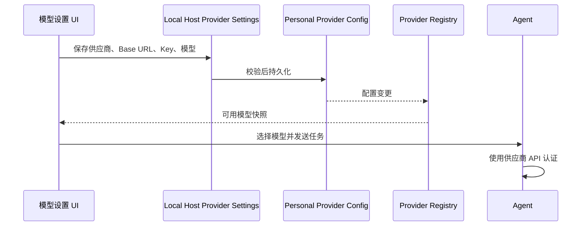

# AIbuddy API 接入模式

## 产品规则

- 移除 AIbuddy 自身的 Z.ai / BigModel 账号登录、登出、授权回调、登录恢复和刷新流程；桌面、Web、CLI 均无需产品账号。
- 首次启动直接进入工作区。未配置模型时，通过模型设置添加供应商；沿用已有模板、自定义 Base URL、API 协议、API Key、模型 ID、模型编辑和连接测试能力。
- 模型设置只提供直接 API 接入，不展示账号套餐、购买、续费和账号余额入口。Z.ai / BigModel 的直接 API 接入与其他供应商一样可用。
- 不恢复、不删除旧产品账号凭据；旧凭据不得触发后台登录、套餐查询或自动重新登录。产品账号 RPC 保留明确的停用响应供旧调用方收尾，不再创建授权流程。
- 远程工作区的连接鉴权、SSH 凭据和第三方 MCP 自身的授权继续保留。移除产品账号不扩大这些资源的访问权限。
- 云端私有分享不提供产品登录入口；公开内容只按匿名权限访问，不能绕过服务端访问控制。

## 所有者和顺序

继续使用 Local Host 的 Provider Settings Service 和 Personal Provider Config 作为供应商配置唯一写入路径；Renderer 只维护表单草稿，Registry/Model Selection 派生可用模型。远程 workspace 继续使用现有 identity、owner/lease 和配置同步。

## 验收场景

1. 使用空数据目录启动桌面，直接进入工作区；侧栏、设置、CLI 帮助均没有产品登录和套餐购买入口。
2. 通过现有供应商表单新增自建 OpenAI 兼容 API，填写 Base URL、Key、模型 ID；连接测试和实际简单对话成功，重启后仍可用。
3. 无产品账号或存在旧产品凭据时，产品 OAuth 服务均不发网络请求、不恢复用户、不接受新的登录流程；普通 API 密钥和远程连接凭据仍可读写。
4. 中英文界面与手机宽度可操作；第三方 API 返回 401 时显示连接配置错误，不启动产品登录。
5. 执行根目录与 CLI 类型检查、lint、架构检查和可用构建；记录已有失败及无法实测的平台边界。

## 已执行验证（2026-09-22）

- 根目录 `pnpm typecheck`、`pnpm lint` 与 `pnpm verify:pre-push` 通过（lint 68 项 warning）；架构检查 0 违规。
- `pnpm fmt:check` 未通过：全仓 165 个文件需格式化，本次 API 功能改动文件不在该列表；未展开全仓格式整理。
- CLI 独立类型检查 27/27 通过；CLI lint 与原始 HEAD 对比均为 86 处已有错误，没有新增错误位置。
- `node --import tsx --test packages/services/test/apiOnly.test.ts`：8 项通过，services 全部测试 18 项通过。覆盖 Desktop/Web/CLI 登录停用、旧凭据保留、直接 API 解析、远程配置分发幂等和失败回滚。
- 使用隔离数据目录启动 macOS Electron，通过设置界面新增自定义 Chat Completions 供应商，填写本地测试端点、测试密钥及模型 ID；连接测试、流式对话均成功。
- 关闭应用后注入旧产品登录凭据，再使用相同隔离目录重启；API 配置、模型选择仍存在，再次对话成功，旧凭据原样保留且界面没有登录态。
- 本地测试端点返回 401 时，界面显示供应商鉴权失败，不打开产品登录或重启应用。
- 英文设置及 390×844 共享 UI 布局已检查，页面无横向溢出，小屏可打开模型编辑器；未在实体手机上验证远程连接。
- Desktop、Web、桌面 Agent 和独立 CLI 构建通过。构建后的 CLI `--help` 无登录命令，`login` / `logout` 返回未知命令。
- API 验证使用本地可控服务，没有使用用户真实 API Key，也未验证外部供应商的实际账户、Windows/Linux 安装包或签名发布。

账号套餐支持的闲时任务无法通过普通 API 获得云端权益；相关购买入口已停用。定时自动化继续使用现有模型配置。
