# AIbuddy 桌面发布

## 规则

- 将当前 AIbuddy 改名、API 接入及新图标发布为 `3.15.0`。应用版本唯一来源是根 `package.json`；CLI 独立版本不随桌面版本修改。
- GitHub Actions 手动触发五个原生 runner：Linux x64/arm64、Windows x64、macOS x64/arm64。产物分别为两份 `.deb`、一份 NSIS `.exe`、两份 `.dmg`。
- 复用现有 runtime 准备、生产构建及 electron-builder 配置。每个阶段只运行一次；远端运行时按现有 `AIBUDDY_SKIP_REMOTE_ASSETS=1` 跳过，桌面内置 Agent、插件与搜索工具完整打包。
- 先准备本地 runtime、生成 CLI workspace 包的 dist，再执行品牌及 API 回归检查；全新 checkout 不得依赖开发机已有构建缓存。
- 安装依赖时禁用自动生命周期脚本；显式安装 Electron，使用仓库已提供的 N-API prebuild。Linux node-pty 仍由既有 beforePack 恢复。这避免宿主 Ubuntu 的临时原生编译物进入 Debian 10 包；所需原生绑定必须通过成包测试。
- afterPack 完成 ASAR 重打包后负责恢复 macOS node-pty `spawn-helper` 的执行权限；ASAR 解包不保留 unpacked 文件的可执行位，必须在最终产物上修复。成包终端测试必须执行真实 shell 并收到输出。
- Debian 包声明 glibc 2.28 及桌面运行依赖。检查最终 deb（包括 app.asar 解包内容）内每个 ELF 的架构和所需 GLIBC、GLIBCXX、CXXABI 版本；不能仅检查 deb 的 Depends。
- 两种 deb 均放入对应架构的 Debian 10 Buster 容器安装，在 Xvfb 下启动真实成包应用，并验证首页、node:sqlite 及 node-pty。macOS/Windows 也启动各自成包应用验证相同基础能力。
- 所有测试使用临时用户数据目录，不读取开发者现有 AIbuddy/ZCode 配置。CI 不需要真实 API Key，不验证真实模型服务。
- 每个平台上传安装包、SHA-256 清单与测试证据。只有五个平台全部成功，且手动输入 `publish=true`，才允许创建同一 commit 的注释标签及普通 Latest Release。
- 先创建草稿 Release、上传并核对完整的五份安装包与校验清单，再公开；失败保留日志和草稿。重试可复用同一 commit 的标签，不得移动已存在且指向不同 commit 的标签。
- 当前无发布签名证书；Windows/macOS 产物不声明已获得开发者签名或 Apple 公证。Release 说明公开这一状态。

## 所有者与顺序

版本由根 package.json 所有；平台资产由既有 desktop 打包脚本所有；工作流只组织构建、成包验证和发布，不保存业务状态。

```mermaid
flowchart LR
  C[固定 Git commit / 版本] --> P[准备本地 runtime / CLI 产物]
  P --> Q[类型 / lint / 架构 / 回归检查]
  Q --> B[五个平台原生构建]
  B --> V[成包启动与终端检查]
  V --> L[Linux 额外 Debian 10 / ELF 检查]
  L --> A[安装包 / SHA-256 / 验证证据]
  A --> G[全部通过 + publish=true]
  G --> T[同 commit 注释标签]
  T --> D[草稿上传 / 校验]
  D --> R[普通 Latest Release]
```

## 验收边界

CI 成包启动、终端和 SQLite 成功代表基础运行兼容；真实 API、GPU、音视频、系统权限和 Windows/macOS/Linux 实机上的所有插件功能仍需目标环境验证。
