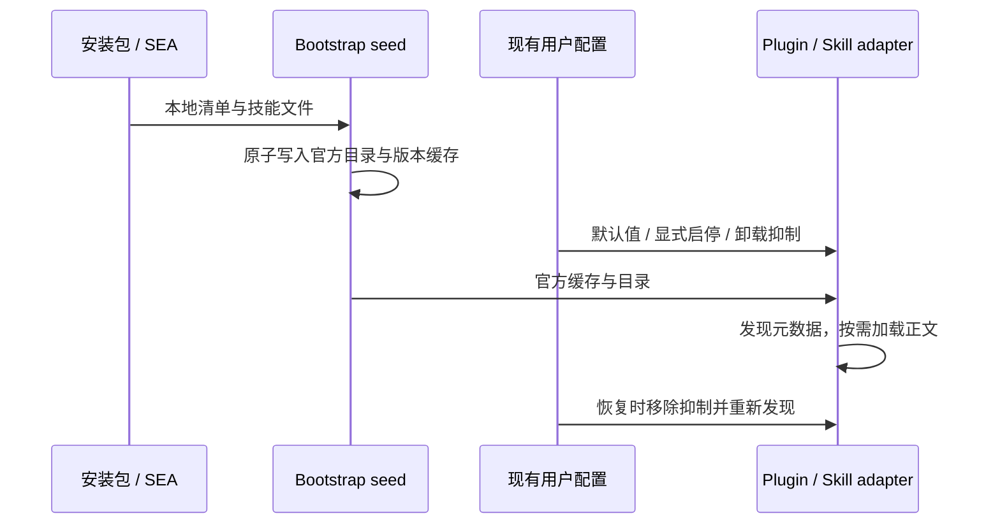

# 内网工作技能包

## 产品规则

- 新增 `intranet-skills` 1.0.0 纯内容插件，商店显示“内网工作技能”，首次使用默认启用。
- 随桌面安装包和远程 Agent SEA 分发六个中文技能：代码审查、SQL 排查、日志分析、CSV/JSON 校验、技术文档、UOS/Linux 诊断。
- 只携带本仓库原创 `SKILL.md` 和插件清单；无 MCP、hook、脚本、外部图标、运行时依赖和后台进程。发现时读取技能元数据，调用时沿现有 SkillPort 加载正文。
- 安装、发现、停用、卸载后恢复均复用内置插件机制，无公网下载；模型推理使用用户已有配置，技能包不包含模型或数据库驱动。
- 技能仅使用当前环境已提供的工具和本地资料，不指示自动安装依赖或上传数据。缺少证据、数据库连接、Office 工具时明确标注未验证范围。
- 不更改现有商店联网策略、浏览器插件或其他功能。用户显式停用、单技能停用、卸载抑制态继续生效，重启不得重新启用。

## 状态与边界

Bootstrap 的官方定义拥有版本、默认启用与必需资产清单；现有配置文件拥有 enabledPlugins / suppressedBuiltins，Node plugin adapter 投影可用技能根。Settings 共享默认集合与 Bootstrap 保持一致。无新状态、协议或 UI 入口。

资产缺失沿现有 seed 诊断处理，打包阶段校验六个必需 SKILL.md，避免发布残缺包。升级不引入配置迁移，不恢复此前已移除的重依赖技能包。

## 验收

1. 新用户离线发现插件，默认启用，恰好六个技能，正文完整且不截断，无 MCP / hook / command。
2. 插件停用后不提供技能根；再次发现仍停用。单技能停用只隐藏目标技能。
3. 卸载后再次 seed 不重新激活；目录仍可展示，离线安装可恢复。
4. 桌面暂存目录和 SEA manifest 包含插件清单与全部技能，版本一致；缺少技能时打包失败。
5. 实际使用场景覆盖：凭源代码定位缺陷；不虚构 SQL 方言/字段；区分日志先后与因果；保留编号前导零；文档未知数据留空；诊断先测量再给可回退措施。内容不承诺执行过未执行的验证。

验证入口：`node --import tsx scripts/intranet-skills-smoke.mjs`；可传 `--staged-root <glm目录>` 验证桌面资产及 OfficeCLI 技能发现。Desktop dev 构建也暂存该纯内容插件。真实 UOS 运行及内网模型任务效果另行验收。

## 验证记录（2026-09-22）

- 六个 SKILL.md 均通过 skill-creator 格式验证；离线首次发现、正文一致性、单技能停用、插件停用、卸载后再次 seed、恢复和缺失资源拒绝均通过。
- macOS arm64 桌面暂存目录的真实文件通过同一验证；OfficeCLI 插件默认启用且技能正文可读取。
- 根 typecheck / lint 通过（lint 66 warnings、0 errors）；CLI typecheck 27 项通过。CLI lint 未通过，当前输出 84 项存量错误，未改动相关业务文件；本次 CLI 修改文件单独 lint 为 0 errors、1 项原有 warning。
- 架构检查：0 violations / 0 baseline / 0 new。无新增依赖或后台进程；未发布安装包。
