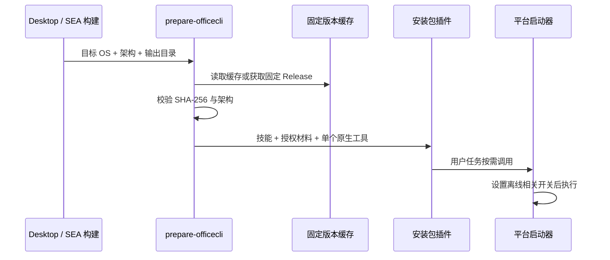

# OfficeCLI 内置技能与原生工具

## 产品规则

- 将 iOfficeAI/OfficeCLI `v1.0.152` 作为独立官方内置插件 `officecli`，默认启用，复用现有技能发现和插件启停/卸载/恢复。
- 为 Windows、macOS、Linux 的 x64 / arm64 分发对应官方二进制，每个安装包只带当前目标的一份。Linux 使用 glibc 版本；不将 Alpine/musl、LoongArch 或其他架构混作兼容目标。
- 构建时下载固定 Release，校验已登记 SHA-256 与二进制格式/架构；构建缓存可提前搬入内网，无需运行安装脚本。缺失、摘要错误或架构不符时中止构建，不回退到 PATH 上的未知程序。
- 安装包包含工具、技能正文、启动器、上游 LICENSE / NOTICE / THIRD-PARTY-NOTICES。保留上游作者和修改说明，不向系统 PATH、其他 Agent 或用户全局配置安装内容。
- 技能通过平台启动器调用工具，固定设置上游已有的 `OFFICECLI_SKIP_UPDATE=1`、`OFFICECLI_NO_AUTO_INSTALL=1`、`OFFICECLI_NO_AUTO_RESIDENT=1`。默认无更新检查、自动安装或自动驻留；大量修改优先使用 batch，显式 open 后必须 close。
- DOCX / XLSX / PPTX 基础读写使用本地文件。截图需要机器已有的支持浏览器；HTML 内的远程资源和专门插件不保证离线可用，技能不得自动联网补装。AI 模型仍由应用现有配置提供。

## 所有者与接口

`scripts/prepare-officecli.mjs` 是构建资产的单一准备入口，拥有平台映射、版本和摘要校验；输出完整插件目录。Desktop dev / 打包及 SEA 均调用它，分别指定输出目录，避免交叉构建覆盖同一份源二进制。缓存位于仓库 `.cache/officecli/<version>/`，不提交二进制。

Bootstrap 官方定义拥有插件发现与必需文件列表，现有 plugin config 拥有启停和卸载抑制，SkillPort 只加载技能。运行时无新下载器、服务、MCP、状态存储或环境变量；启动器只设置上游定义的变量。

## 验收

1. 六个平台映射准确，拒绝未知平台/架构；损坏缓存不得进入安装包。
2. 缓存就绪后，准备和发现插件不依赖网络；每个目标只打包匹配的二进制，Unix 可执行权限保留。
3. Desktop dev、生产暂存、SEA 资源都包括技能、工具及许可材料；插件默认启用集合一致。
4. 本机通过启动器完成版本查询及 DOCX/XLSX/PPTX 创建、写入、读取与 validate。基础验证与 Office/WPS 版式验收分开报告。
5. Linux 二进制静态检查覆盖 ELF 架构、符号版本和依赖；静态结果不替代 UOS 20 实机测试，Windows 与其他架构未执行时明确说明。

测试入口：预置六平台缓存后运行 `node scripts/officecli-smoke.mjs`，覆盖平台资产和 SEA 选择、本机启动器与三种文件读写。

构建缓存预置方法：按 `scripts/prepare-officecli.mjs` 的固定版本/文件名放入 `.cache/officecli/<version>/`，构建仍验证摘要。升级必须同时更新技能来源、许可材料、摘要、官方定义版本和验证记录。

## 验证记录（2026-09-22）

- 六平台固定 Release 均已下载并通过 SHA-256、Mach-O / ELF / PE 架构校验；每份约 32–34 MiB，构建只携带当前目标。
- 禁用构建进程网络后，六平台从缓存暂存与 SEA 资产选择通过；错误摘要、未知架构、缺失可执行文件均拒绝。
- macOS arm64 启动器的 `--version`、DOCX/XLSX/PPTX 创建、写入、读回、validate 通过，包括路径空格和中文参数。七个技能均通过格式验证。
- `pnpm --dir packages/desktop prepare:agent-bundle` 通过，实际 glm 目录可 seed 并默认启用内网技能及 OfficeCLI。SEA 验证覆盖资源清单，未重新生成或运行六平台 SEA 可执行文件。
- Linux x64 / arm64 ELF 静态版本引用最高为 GLIBC_2.27、GLIBCXX_3.4.22、CXXABI_1.3.7；依赖 glibc、libstdc++ 等系统库。Windows PE 包含 UCRT imports，沿用操作系统运行库；不将它视为完全静态二进制。
- 根 typecheck、根 lint、CLI typecheck、架构检查通过；CLI lint 输出 84 项既有业务代码错误，本次修改文件的定向检查 0 errors。完整记录见 intranet-skills.md。
- 上游授权与署名材料已随插件保存，集中声明/清单已再生成，许可标识和声明新鲜度基础检查通过。仓库另有 19 项既有材料待补齐，未将该基础检查记为严格发布检查通过。
- 构建前按现有锁文件恢复缺失依赖，未修改依赖声明或锁文件。原生 Windows、Linux/UOS 20、其他 macOS 架构及 Office/WPS 版式仍待实机验收；本次未生成或发布安装器。
