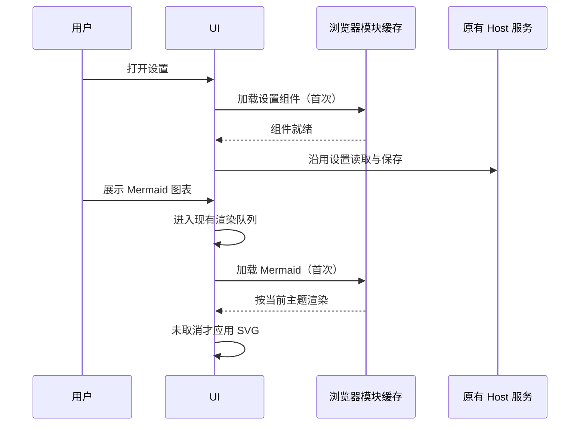

# 低配置设备界面性能

## 产品规则

- Desktop 与 Web 保留现有功能、主题、语言和键盘操作。优先减少首页加载和持续重绘，不按 CPU 品牌裁剪功能。
- 设置页仅在用户进入设置时加载；空工作区与已有工作区共用同一个延迟入口。加载期间显示本地化状态，失败继续由现有错误边界处理。
- Mermaid 库仅在实际渲染图表时加载；聊天代码块、文件预览和 Streamdown 共用入口。保留 strict 安全配置、主题、预览回调、失败时的源码显示及原有渲染队列。
- 工具、思考、权限和工作流的状态文字改为静态可读文本，去掉持续背景渐变及其强制合成层。状态文案、颜色、进度指示和交互保持不变。
- Agent 执行、模型请求、命令 admission、owner/lease、Desktop continuous 与 Web replayable 链路沿用现有实现。

## 所有者与顺序

设置仍由 Host 的设置服务所有；UI 只延迟加载组件，异步模块由浏览器模块缓存管理。MermaidBlock 继续拥有图表渲染队列及取消后的结果丢弃。

## 验收

1. 使用相同构建配置对比修改前后首页静态 JS 体积；未打开设置或图表时不请求对应延迟模块。
2. 隔离数据目录启动桌面，打开设置、切换设置项、返回工作区、再次打开均可用。
3. 浏览器回归覆盖图表延迟加载、明暗主题、连续图表、无效语法回退、取消后旧结果不覆盖新内容，以及窄屏预览。
4. 三类状态文字在明暗主题和 reduced-motion 下均可读、无持续渐变动画；保留操作按钮。
5. 执行类型检查、lint、架构检查及 Desktop/Web 构建。macOS/本地浏览器结果单独报告，UOS 20 实机 CPU、内存和帧率待目标设备验证。

## 已执行验证（2026-09-22）

- 使用 Node 24.14.0、pnpm 10.33.2，同一配置分别构建修改前后 Desktop renderer。首页静态引用的 JS 从 269 个、8,443,058 字节降至 240 个、7,441,135 字节，体积减少 11.87%。该数据衡量构建体积；启动耗时、常驻内存和 UOS 帧率仍需实测。
- `node scripts/ui-performance-smoke.mjs --desktop` 通过。需要已安装 Google Chrome、Electron 及已构建的桌面 out；全部运行数据使用临时目录。
- 浏览器验证了未展示图表时不加载 Mermaid、加载过程中更换图表后保留最新结果、明暗主题实际颜色切换、双击预览、语法错误回退及 390px 窄屏。三类状态文字在明暗主题与 reduced-motion 下均可读、无动画。
- macOS Electron 验证了首页不加载设置模块，首次进入设置才加载，切换设置项、返回工作区和再次打开均正常，模块复用。file:// 下通过 CDP 的实际脚本加载事件验证。
- `pnpm typecheck`、`pnpm lint`、`pnpm architecture:check --changed`、修改文件格式检查、Desktop bundles 与 Web 生产构建通过。Lint 为 0 错误、66 项已有警告（修改前 68 项）。
- 本轮涉及 UI 模块，没有新增依赖或修改 Agent/Host 业务状态。尚未执行 UOS 实机、远程手机连接或真实模型服务性能测试，未发布安装包。
